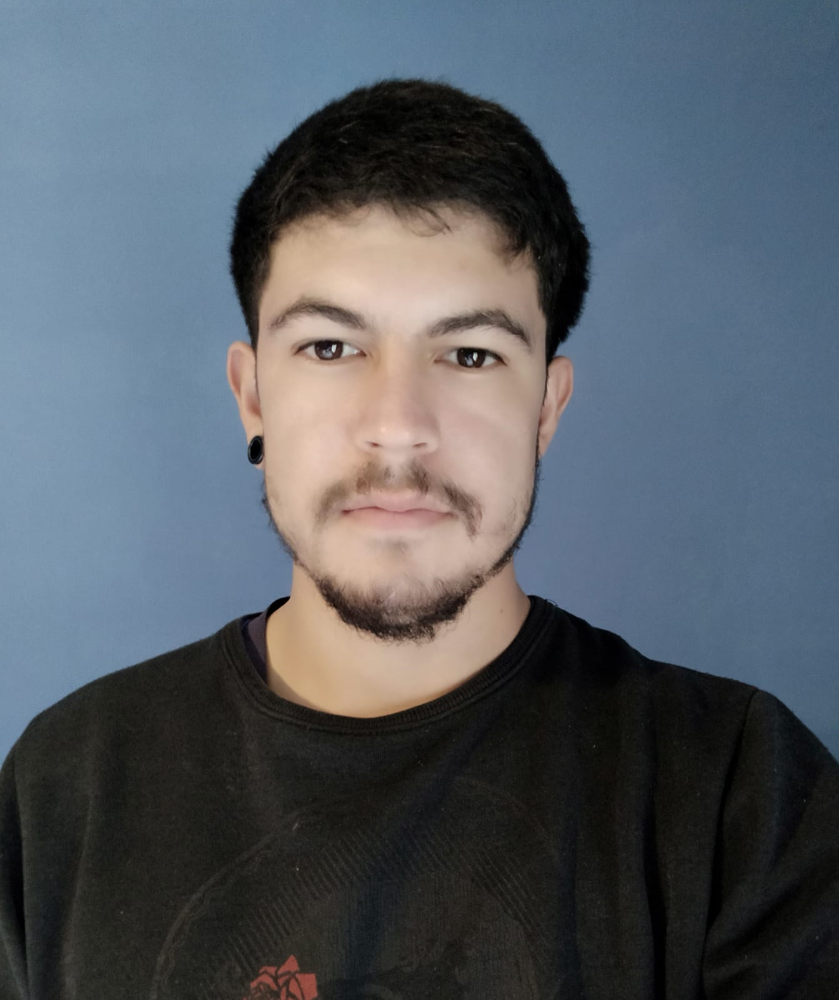

Bienvenido al perfil de..
# Tomás Ceferino Lynn

Tengo 21 años, soy alumno de la Universidad Nacional de Hurlingham, el cual me encuentro cursando el 2do año de la tecnicatura en programacion, para luego continuar con su Licenciatura en Informatica. :man_technologist:

## Materias aprobadas hasta el momento :book:
* Matematica para informatica I.
* Introduccion a la logica y problemas computacionales.
* Organizacion de computadoras I.
* Nuevos entornos y lenguaje.
* Taller de lenguaje de marcado y tecnologias web.
* Programacion estructurada.

## Materias cursando :book:
* Matematica para informatica II.
* Ingles I.
* Programacion de objetos I.

Me considero una persona muy apasionado al deporte.

## Deportes realizados
* Futbol 11. :soccer:
* Futsal. :soccer:
* Rugby. :rugby_football:
* Voley. :volleyball:
* Handball. :handball_person:
* Natacion. :swimmer:
* Basquet. :basketball:

## Tengo como proyectos principales en este año. 
* Dedicar el mayor tiempo posible fuera y dentro de la universidad a lo referido con la Programacion.
* Encontrar mi primer trabajo como Programador.
